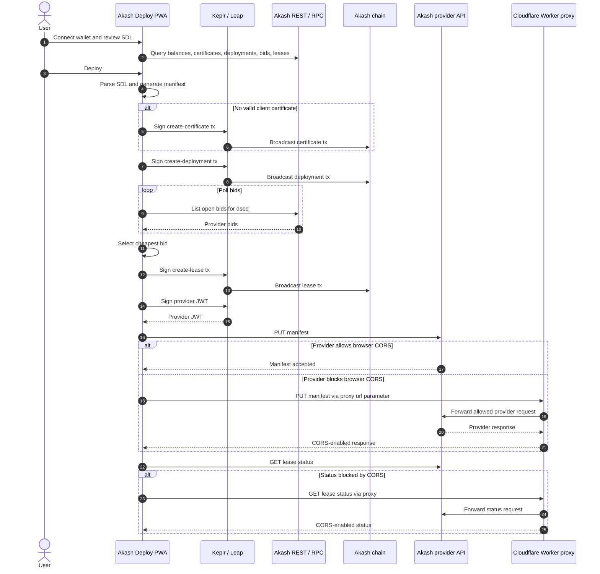

# Akash Deploy PWA

Wallet-only Akash deployment helper for the browser. Connect **Keplr** or **Leap**, preview/edit an SDL, create a deployment, accept a bid, create a lease, upload the manifest, and inspect current leases without running the Akash CLI locally.

Mainnet is the default path. Sandbox/testnet remain available under **Advanced network**, but they are currently less reliable than mainnet because public faucet, REST/RPC, and provider behavior can drift.

## Quick Start

```bash
npm install
npm run dev
```

Open `http://localhost:5173` or another wallet-extension-compatible origin.

1. Connect Keplr or Leap.
2. Fund the wallet with AKT for gas and deployment escrow.
3. Review or edit the SDL.
4. Deploy and approve the wallet prompts.
5. Use the lease cards to load provider access details, open explorer links, or close unused deployments.

## Provider CORS Proxy

Some providers do not expose browser-compatible CORS headers on their provider API. In that case, chain transactions can succeed, but browser manifest upload or live lease status can fail.

Deploy the included Cloudflare Worker:

```bash
cd workers
wrangler deploy
```

Then set:

```bash
VITE_PROVIDER_PROXY_URL=https://your-worker.example.workers.dev/
```

The provider target remains variable. The PWA sends the provider API URL as a `url` query parameter, and the Worker only forwards the Akash provider paths needed for manifest upload and lease status. The wallet-signed provider JWT passes through the Worker, so run your own trusted deployment.

## Configuration

Copy `.env.example` to `.env` when you need to override defaults.

Common values:

```bash
VITE_PROVIDER_PROXY_URL=https://your-worker.example.workers.dev/
VITE_MAINNET_REST=https://akash-rest.publicnode.com
VITE_MAINNET_RPC=https://akash-rpc.publicnode.com:443
```

Use **Advanced network** in the app for sandbox/testnet or custom REST/RPC endpoints.

## Deployment Flow



## Notes

- Mainnet requires real AKT. Gas is not refundable.
- Closing unused deployments returns remaining deployment escrow after settlement.
- The UI links lease cards to explorer/account and raw REST transaction queries so gas usage can be inspected.
- Sandbox/testnet are useful for development, but currently not the recommended happy path.
- The SDK and certificate tooling make the JS bundle large; the PWA precache limit is raised in `vite.config.ts`.

## Scripts

- `npm run dev` - Vite dev server
- `npm test` - Unit tests
- `npm run lint` - ESLint
- `npm run build` - Production PWA build
- `npm run preview` - Serve `dist/`
