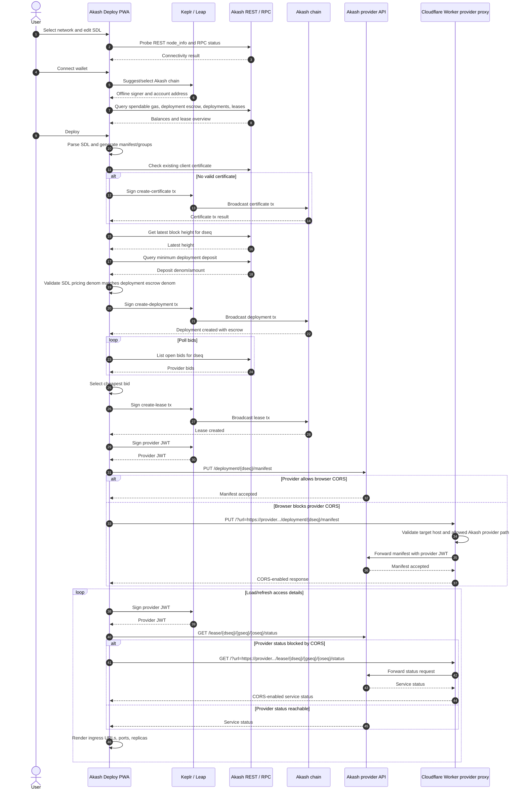

# Akash Deploy (PWA)

Minimal React PWA for **wallet-only** Akash tenant deployments: preview an SDL, connect **Keplr** or **Leap**, then walk through certificate creation, deployment, bids, lease, and manifest upload using `@akashnetwork/chain-sdk/web`.

## Quick start

```bash
npm install
npm run dev
```

Open the app over **HTTPS** or `localhost` so the wallet extension can inject (`window.keplr` / `window.leap`).

## Sandbox end-to-end test

1. Install [Keplr](https://www.keplr.app/) (or Leap). Switch network to **Akash Sandbox** after the app suggests the chain (Keplr: approve the chain suggestion).
2. Fund the wallet with sandbox **uakt** from the official sandbox faucet (see [Akash docs — SDK quick start](https://akash.network/docs/api-documentation/sdk/quick-start/) for the current faucet URL).
3. In the app, open **Advanced network**, choose **Sandbox**, connect the wallet, optionally edit the SDL, then **Deploy**.
4. Approve transactions in the wallet when prompted (certificate, deployment, lease). Manifest upload uses a **JWT** signed via the wallet’s amino signer.

## Mainnet

Mainnet is the default network. You need real **AKT** for gas and deployment escrow. Override RPC/REST via env vars or the **Advanced network** panel (see `.env.example`).

## BME testnet (`testnet-oracle`)

Select **Testnet (BME / testnet-oracle)** for the public BME-capable network from [`akash-network/net` `testnet-oracle`](https://github.com/akash-network/net/tree/main/testnet-oracle). Gas is test **`uakt`**.

The repo’s [`faucet-url.txt`](https://github.com/akash-network/net/blob/main/testnet-oracle/faucet-url.txt) still points at **`https://oraclefaucet.dev.akash.pub/`**, which is often unreachable. This app defaults the primary faucet link to **`https://faucet.dev.akash.pub/`** and keeps the oracle host as an **Alternate** link. Override with `VITE_TESTNET_FAUCET_URL`, `VITE_TESTNET_FAUCET_ALT_URL`, or a comma-separated `VITE_TESTNET_FAUCET_URLS` (see `.env.example`).

## Configuration

Copy `.env.example` to `.env` and adjust endpoints if public nodes change or you use your own gRPC-gateway / RPC with CORS enabled for browsers.

### Provider CORS proxy

Some Akash providers do not return browser CORS headers on their provider API, so the deployment and lease transactions can succeed but manifest upload or live lease status can still fail in the browser.

Deploy [`workers/provider-proxy.js`](workers/provider-proxy.js) to a Cloudflare Worker or compatible runtime you control:

```bash
cd workers
wrangler deploy
```

Then set:

```bash
VITE_PROVIDER_PROXY_URL=https://your-worker.example.workers.dev/
```

The target provider URL remains variable: the app sends it as a `url` query parameter and the Worker only forwards Akash provider API calls for manifest upload and lease status. The wallet-signed provider JWT passes through the Worker, so use your own trusted deployment.

## Deployment flow

The PWA is fully browser-driven. Chain transactions are signed in the wallet, while the Cloudflare Worker is only a temporary CORS bridge for provider API calls until providers reliably expose browser-compatible CORS headers.



## Caveats

- **CORS**: The browser must reach REST/RPC endpoints and provider APIs that allow browser origins. If provider manifest/status calls are blocked, use the optional provider proxy above.
- **Provider HTTPS**: Manifest `PUT` targets the provider `hostUri` from chain queries; TLS to provider APIs may fail if the certificate cannot be validated in the browser.
- **Bundle size**: The Akash SDK + `jsrsasign` (certificate generation) produces a large JS bundle; the service worker precache limit is raised in `vite.config.ts`.

## Scripts

- `npm run dev` — Vite dev server
- `npm run build` — Production build (PWA service worker generated)
- `npm run preview` — Serve `dist/`
